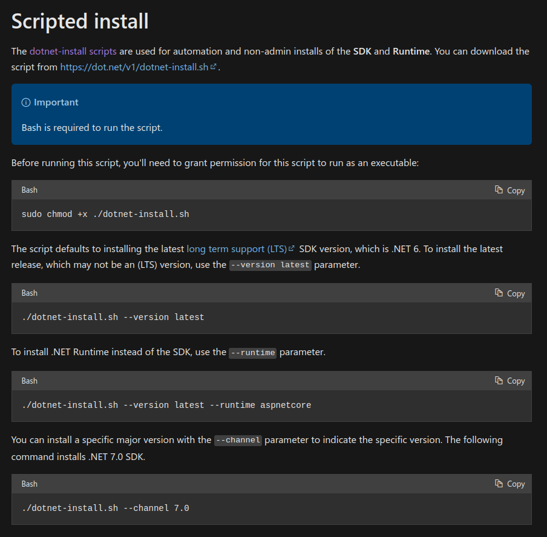
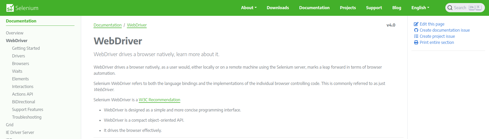
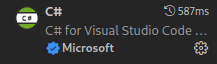
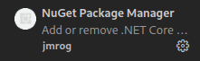
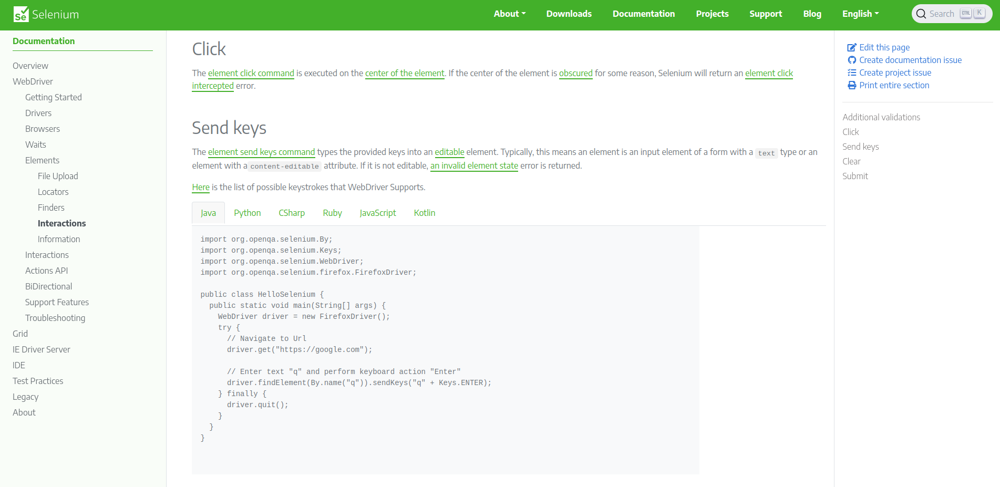
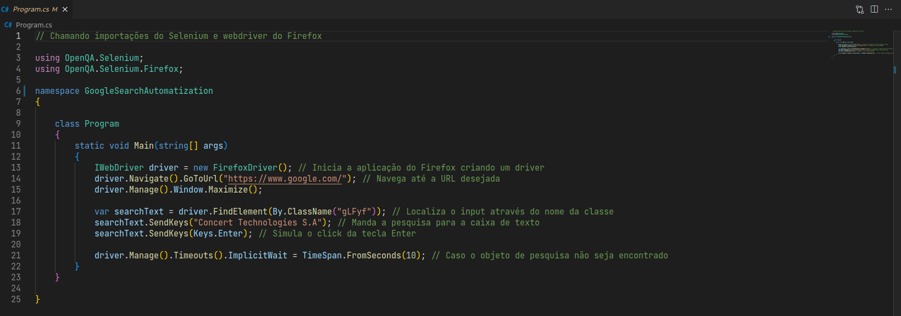
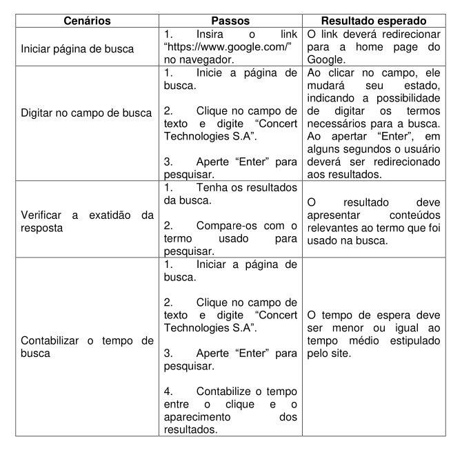

<h1 align = "center">Google Search Automatization</h1>

## 📲 Sobre

A seguinte aplicação trata-se de um programa feito com Selenium e Dotnet para automatizar o processo de busca do Google, tal programa foi desenvolvido para o processo seletivo da Concert Technologies S.A.

## 📋 Tabela de conteúdo
* [Sobre]()
* [Tabela de Conteúdo]()
* [Processo de desenvolvimento]()
  * [Instalação das dependências]()
  * [Programação]()
  * [Documentação e testes]()
* [Tecnologias]()
* [Autor]()

 ## 🧑‍💻 Processo de desenvolvimento

 ### Instalação das dependências

 
A primeira coisa a se fazer ao iniciar um novo projeto é preparar o ambiente de desenvolvimento, logo tratei de instalar o dotnet em minha máquina, para assim criar um novo projeto e importar o Selenium dentro dele.

 </img>
 </img>

 
Vale ressaltar que meu SO no momento é o Arch Linux, então instalei as dependências do dotnet via script para executar através do terminal.

 
O editor de código usado para programar foi o Visual Studio Code, logo também fiz uso de duas extensões que me auxiliaram a programar em C# e a importar os pacotes NuGet para dentro do projeto.

 </img>
 </img>
​
### Programação

Para programar fiz uso principalmente da documentação do Selenium, que possui todo o processo e métodos necessários para lidar com o Selenium Webdriver e realizar testes em páginas web.

</img>

Meu objetivo era basicamente abrir um navegador através de algum driver, para em seguida redirecionar para a página de busca do Google através da URL e então realizar a busca.

</img>

### Documentação e testes

Além da criação do programa em si, era necessário que fossem criados cenários que avaliassem a usabilidade da página de busca do Google, cenários estes que estão disponíveis neste repositório.

</img>

## 🔧 Tecnologias

- [Selenium](https://www.selenium.dev/)
- [.NET](https://dotnet.microsoft.com/en-us/)
- [C#](https://learn.microsoft.com/en-us/dotnet/csharp/)
- [Visual Studio Code](https://code.visualstudio.com/)
- [Firefox](https://www.mozilla.org/pt-BR/firefox/new/)

## ✍️ Autor

<b><i>[Gustavo Fernandes](https://github.com/gufernandess)</i>